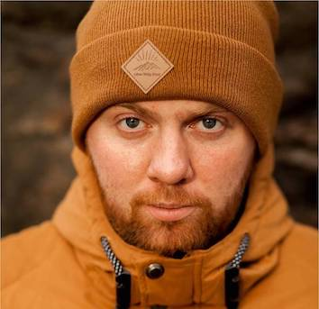

 

	 

Chechnev Pavel
Quality assurance (QA) engineer

Quality assurance with 3+ years manual testing web applications and products for managing documents, construction processes, databases with personnel and devices. 2+ years mobile testing(native(Android and iOs) and PWA)
Experience in creating and covering product (or application) tests, maintaining technical documentation, conducting regression cycles. 
Knowledge of Java and Groovy, creation and maintenance of automated tests for the product.
ㅡ
Main Skills	 

●	Test case development 
●	Java, Groovy 
●	Allure Report 
●	Zephyr Squad, Zephyr Scale 
●	GitLab, Jenkins 
●	Basic knowledge of HTML, CSS, SQL, Kotlin, SwiftUi 
●	Manual testing(web, mobile, API), Test documentation, Usability testing 

ㅡ
Education	 

2005-2010 Emperor Alexander I St. Petersburg State Transport University.
Computer Engineering, Computer Hardware and Computer Networks Maintenance Engineer. 
2019-2020 GeekBrains University Faculty Software testing 
QA Engineer.
ㅡ
Professional
experience	 

Natlex (STRABAG Societas Europaea) / Quality assurance (QA) engineer
02/2020 – Present

●	Writing and supporting test cases, checklists 
●	Manual testing of web applications and mobile applications (Android, iOS, PWA) 
●	Regression testing 
●	API testing 
●	Writing autotests 
●	creating test documentation 
ㅡ
Certificate

	 
2019-2020- Quality Assurance courses
2021- iOS App Development(Basic knowledge of SwiftUi)
2021- Android App Development(Basic knowledge of Kotlin)
2022- Mobile testing course
ㅡ
Language
Skills	 
Russian
Native speaker
English / B1
Intermediate